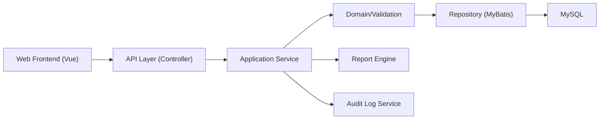
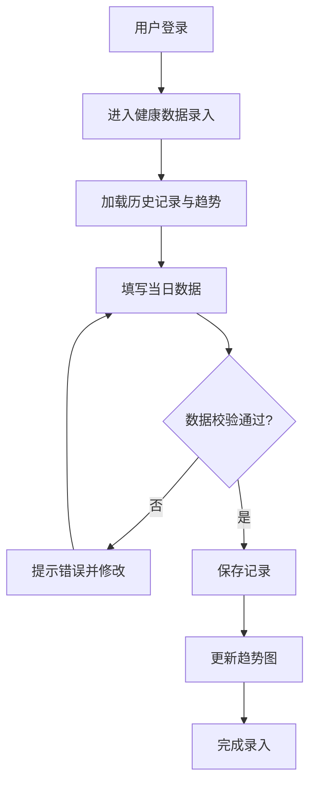
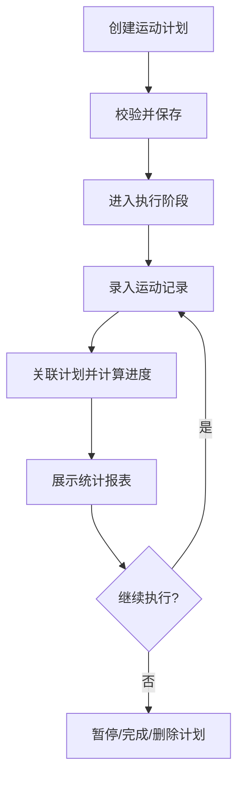

# 个人健康管理与运动追踪平台设计文档（V1.0）

## 1. 文档说明

### 1.1 目的
基于 `requirement/requirement.md` 的需求内容，形成一份可直接指导后续开发与联调的系统设计文档。本文档只包含设计，不包含代码实现。

### 1.2 适用范围
1. 管理端与用户端功能设计。
2. 后端服务、数据库、接口、鉴权与日志设计。
3. 性能、安全、可用性等非功能设计。

### 1.3 设计原则
1. 前后端分离，职责清晰。
2. 以用户隐私与数据安全为优先。
3. 支持后续功能扩展和规模扩容。

## 2. 需求分析结论

### 2.1 业务目标
1. 为普通用户提供健康数据、运动计划、饮食记录、健康报告的一体化管理能力。
2. 为管理员提供用户治理、内容治理、权限治理、审计追踪能力。
3. 通过可视化和报告提升用户对健康趋势的理解与行动效率。

### 2.2 用户角色与权限边界
1. 超级管理员：具备平台全量后台权限，负责角色和权限配置。
2. 普通管理员：具备被分配的后台权限，负责日常运营维护。
3. 普通用户：仅能访问和维护自己的个人数据及业务记录。

### 2.3 功能域拆解
1. 公共能力：注册登录、验证码、找回密码、个人设置、消息提醒、日志记录。
2. 管理端能力：用户管理、健康数据管理、运动项目管理、饮食食谱管理、角色权限管理、系统日志管理。
3. 用户端能力：健康档案、健康数据录入、运动计划管理、运动数据追踪、饮食记录管理、健康报告生成。

### 2.4 非功能需求（来自需求文档）
| 维度 | 指标 |
| --- | --- |
| 页面加载 | `<= 3s` |
| 普通查询/提交 | `<= 1s` |
| 复杂统计/报告 | `<= 5s` |
| 在线并发 | `>= 1000` 用户在线 |
| 数据提交吞吐 | `>= 500` 条/分钟 |
| 可用性 | 年可用性 `>= 99.9%` |
| 安全 | HTTPS、加密存储、RBAC、防 SQL 注入/XSS/CSRF |

## 3. 总体设计

### 3.1 技术栈
1. 前端：Vue 3、Vue Router、Vuex/Pinia、Axios、图表组件。
2. 后端：Spring Boot 3、Spring MVC、Spring Validation、Spring Security（或同类安全组件）、MyBatis。
3. 数据库：MySQL 8.0。
4. 网关与部署：Nginx + Spring Boot 服务。

### 3.2 分层架构

### 3.3 关键设计决策
1. 采用 JWT 进行会话鉴权，配合 RBAC 完成权限控制。
2. 用户隐私数据采用“传输加密 + 存储加密/脱敏”策略。
3. 所有列表类接口统一分页、排序、条件过滤。
4. 健康报告采用异步生成或同步快速生成双模式（根据数据量切换）。

## 4. 模块详细设计

### 4.1 认证与账户模块
1. 功能：注册、登录、找回密码、退出登录、验证码校验。
2. 输入：账号、密码、手机号/邮箱、验证码。
3. 输出：访问令牌、刷新令牌（可选）、用户基础信息。
4. 规则：密码加密存储；登录失败次数达到阈值时触发风控（锁定或二次校验）。

### 4.2 管理端模块

#### 4.2.1 用户管理
1. 查看用户列表与详情。
2. 按账号/姓名/状态检索。
3. 编辑、启用/禁用、删除、导出。

#### 4.2.2 健康数据管理
1. 跨用户查看健康记录。
2. 标记异常记录并支持导出。
3. 按用户和日期范围查询。

#### 4.2.3 运动项目管理
1. 维护运动项目库（新增/编辑/删除/启用禁用）。
2. 配置项目基础参数（热量消耗、难度等级）。

#### 4.2.4 饮食食谱管理
1. 维护食谱（食材、营养成分、适用人群）。
2. 支持启停与导出。

#### 4.2.5 角色权限管理
1. 角色新增、编辑、删除。
2. 角色与权限点绑定。
3. 管理员与角色绑定。

#### 4.2.6 系统日志管理
1. 操作日志查询、导出、清理。
2. 支持按角色、账号、时间范围过滤。

### 4.3 用户端模块

#### 4.3.1 个人健康档案
1. 维护基础体征与病史信息。
2. 支持头像、紧急联系人等扩展信息。

#### 4.3.2 健康数据录入
1. 录入血压、血糖、心率、睡眠、体重等。
2. 自动校验范围并提示异常。
3. 展示趋势图，支持历史查询与编辑。

#### 4.3.3 运动计划管理
1. 创建计划：项目、目标、周期、频率、每次时长。
2. 管理计划状态：执行中、暂停、完成、取消。
3. 展示计划进度与达成率。

#### 4.3.4 运动数据追踪
1. 记录每次运动明细：时长、里程、热量、心率。
2. 与计划关联，自动更新进度。
3. 提供周/月统计视图和导出能力。

#### 4.3.5 饮食记录管理
1. 记录食物摄入或选择推荐食谱。
2. 自动计算热量、蛋白质、脂肪、碳水。
3. 对比推荐摄入量给出饮食建议。

#### 4.3.6 健康报告生成
1. 支持周/月/季度报告。
2. 汇总健康、运动、饮食三类数据。
3. 支持在线查看与 PDF 导出。

## 5. 关键业务流程

### 5.1 健康数据录入流程

### 5.2 运动计划与追踪流程

### 5.3 健康报告生成流程
1. 选择报告周期。
2. 聚合周期内健康、运动、饮食数据。
3. 执行评分与分析规则。
4. 生成图表与建议文本。
5. 返回报告页面并支持 PDF 导出。

### 5.4 图片补充流程要点
1. 健康数据录入流程图强调了三类动作：页面加载历史趋势、字段合法性校验、保存后回显。
2. 运动计划流程图强调了三段闭环：制定计划、记录执行、统计反馈（趋势图与进度更新）。
3. 流程图中出现了“取消/返回修改”等分支，接口设计需支持草稿态或可编辑历史记录。

## 6. 数据库设计

### 6.1 核心实体关系
1. `role 1 - N admin`
2. `user 1 - 1 health_file`
3. `user 1 - N health_data`
4. `user 1 - N sport_plan`
5. `sport_item 1 - N sport_plan`
6. `sport_plan 1 - N sport_record`
7. `user 1 - N sport_record`
8. `diet_recipe 1 - N diet_record`
9. `user 1 - N diet_record`
10. `admin/user 1 - N system_log`

### 6.2 图片还原字段基线（11 张表）

说明：以下字段来自 `requirement.md` 内嵌表结构图片（`wps8~wps18`）的识别结果，字段命名、类型、可空、主键优先按图片落地。

#### 6.2.1 `admin`
| 字段 | 类型 | 可空 | 主键 | 说明 |
| --- | --- | --- | --- | --- |
| `id` | `bigint` | 否 | 是 | 管理员 ID（自增） |
| `username` | `varchar(50)` | 否 | 否 | 管理员账号 |
| `password` | `varchar(255)` | 否 | 否 | 登录密码（加密） |
| `real_name` | `varchar(50)` | 是 | 否 | 真实姓名 |
| `sex` | `varchar(10)` | 是 | 否 | 性别 |
| `email` | `varchar(100)` | 是 | 否 | 电子邮箱 |
| `avatar` | `varchar(255)` | 是 | 否 | 头像地址 |
| `role_id` | `bigint` | 否 | 否 | 角色 ID |
| `status` | `int` | 是 | 否 | 状态（0 禁用 / 1 启用） |
| `create_time` | `datetime(6)` | 否 | 否 | 创建时间 |
| `update_time` | `datetime(6)` | 是 | 否 | 更新时间 |

#### 6.2.2 `role`
| 字段 | 类型 | 可空 | 主键 | 说明 |
| --- | --- | --- | --- | --- |
| `id` | `bigint` | 否 | 是 | 角色 ID（自增） |
| `role_name` | `varchar(50)` | 否 | 否 | 角色名称 |
| `role_key` | `varchar(50)` | 否 | 否 | 角色标识 |
| `remark` | `varchar(255)` | 是 | 否 | 角色描述 |
| `create_time` | `datetime(6)` | 否 | 否 | 创建时间 |
| `update_time` | `datetime(6)` | 是 | 否 | 更新时间 |

#### 6.2.3 `user`
| 字段 | 类型 | 可空 | 主键 | 说明 |
| --- | --- | --- | --- | --- |
| `id` | `bigint` | 否 | 是 | 用户 ID（自增） |
| `username` | `varchar(50)` | 否 | 否 | 用户账号 |
| `password` | `varchar(255)` | 否 | 否 | 登录密码（加密） |
| `phone` | `varchar(11)` | 是 | 否 | 手机号 |
| `email` | `varchar(100)` | 是 | 否 | 电子邮箱 |
| `real_name` | `varchar(50)` | 是 | 否 | 真实姓名 |
| `age` | `int` | 是 | 否 | 年龄 |
| `sex` | `varchar(10)` | 是 | 否 | 性别 |
| `avatar` | `varchar(255)` | 是 | 否 | 头像地址 |
| `status` | `int` | 是 | 否 | 状态（0 禁用 / 1 启用） |
| `create_time` | `datetime(6)` | 否 | 否 | 注册时间 |
| `update_time` | `datetime(6)` | 是 | 否 | 更新时间 |

#### 6.2.4 `health_file`
| 字段 | 类型 | 可空 | 主键 | 说明 |
| --- | --- | --- | --- | --- |
| `id` | `bigint` | 否 | 是 | 档案 ID（自增） |
| `user_id` | `bigint` | 否 | 否 | 用户 ID |
| `height` | `decimal(5,1)` | 是 | 否 | 身高（cm） |
| `weight` | `decimal(5,1)` | 是 | 否 | 体重（kg） |
| `allergy_info` | `varchar(255)` | 是 | 否 | 过敏史 |
| `medical_history` | `varchar(255)` | 是 | 否 | 既往病史 |
| `emergency_contact` | `varchar(50)` | 是 | 否 | 紧急联系人 |
| `contact_phone` | `varchar(11)` | 是 | 否 | 联系电话 |
| `create_time` | `datetime(6)` | 否 | 否 | 创建时间 |
| `update_time` | `datetime(6)` | 是 | 否 | 更新时间 |

#### 6.2.5 `health_data`
| 字段 | 类型 | 可空 | 主键 | 说明 |
| --- | --- | --- | --- | --- |
| `id` | `bigint` | 否 | 是 | 数据 ID（自增） |
| `user_id` | `bigint` | 否 | 否 | 用户 ID |
| `blood_pressure_high` | `int` | 是 | 否 | 收缩压（mmHg） |
| `blood_pressure_low` | `int` | 是 | 否 | 舒张压（mmHg） |
| `blood_sugar` | `decimal(4,1)` | 是 | 否 | 血糖（mmol/L） |
| `heart_rate` | `int` | 是 | 否 | 心率（次/分） |
| `sleep_duration` | `decimal(3,1)` | 是 | 否 | 睡眠时长（h） |
| `weight` | `decimal(5,1)` | 是 | 否 | 当日体重（kg） |
| `record_date` | `date` | 否 | 否 | 记录日期 |
| `create_time` | `datetime(6)` | 否 | 否 | 创建时间 |

#### 6.2.6 `sport_item`
| 字段 | 类型 | 可空 | 主键 | 说明 |
| --- | --- | --- | --- | --- |
| `id` | `bigint` | 否 | 是 | 项目 ID（自增） |
| `item_name` | `varchar(50)` | 否 | 否 | 运动项目名称 |
| `item_type` | `varchar(30)` | 否 | 否 | 项目类型（有氧/无氧） |
| `calorie_per_hour` | `int` | 否 | 否 | 每小时卡路里消耗 |
| `difficulty` | `varchar(20)` | 是 | 否 | 难度等级（低/中/高） |
| `remark` | `varchar(255)` | 是 | 否 | 项目描述 |
| `status` | `int` | 是 | 否 | 状态（0 禁用 / 1 启用） |
| `create_time` | `datetime(6)` | 否 | 否 | 创建时间 |

#### 6.2.7 `sport_plan`
| 字段 | 类型 | 可空 | 主键 | 说明 |
| --- | --- | --- | --- | --- |
| `id` | `bigint` | 否 | 是 | 计划 ID（自增） |
| `user_id` | `bigint` | 否 | 否 | 用户 ID |
| `plan_name` | `varchar(50)` | 否 | 否 | 计划名称 |
| `sport_item_id` | `bigint` | 否 | 否 | 运动项目 ID |
| `plan_cycle` | `varchar(20)` | 否 | 否 | 计划周期（周/月） |
| `sport_frequency` | `int` | 否 | 否 | 每周运动次数 |
| `sport_duration` | `int` | 否 | 否 | 每次运动时长（分钟） |
| `target` | `varchar(255)` | 是 | 否 | 运动目标 |
| `status` | `int` | 是 | 否 | 状态（0 暂停 / 1 进行中 / 2 完成） |
| `start_date` | `date` | 否 | 否 | 计划开始日期 |
| `end_date` | `date` | 是 | 否 | 计划结束日期 |
| `create_time` | `datetime(6)` | 否 | 否 | 创建时间 |
| `update_time` | `datetime(6)` | 是 | 否 | 更新时间 |

#### 6.2.8 `sport_record`
| 字段 | 类型 | 可空 | 主键 | 说明 |
| --- | --- | --- | --- | --- |
| `id` | `bigint` | 否 | 是 | 记录 ID（自增） |
| `user_id` | `bigint` | 否 | 否 | 用户 ID |
| `plan_id` | `bigint` | 是 | 否 | 运动计划 ID |
| `sport_item_id` | `bigint` | 否 | 否 | 运动项目 ID |
| `sport_time` | `datetime(6)` | 否 | 否 | 运动时间 |
| `duration` | `int` | 否 | 否 | 运动时长（分钟） |
| `distance` | `decimal(5,2)` | 是 | 否 | 运动里程（km） |
| `calorie` | `int` | 否 | 否 | 消耗卡路里 |
| `heart_rate` | `int` | 是 | 否 | 平均心率 |
| `remark` | `varchar(255)` | 是 | 否 | 运动备注 |
| `create_time` | `datetime(6)` | 否 | 否 | 创建时间 |

#### 6.2.9 `diet_recipe`
| 字段 | 类型 | 可空 | 主键 | 说明 |
| --- | --- | --- | --- | --- |
| `id` | `bigint` | 否 | 是 | 食谱 ID（自增） |
| `recipe_name` | `varchar(50)` | 否 | 否 | 食谱名称 |
| `food_material` | `varchar(255)` | 否 | 否 | 食材成分 |
| `calories` | `int` | 否 | 否 | 总卡路里 |
| `protein` | `decimal(4,1)` | 是 | 否 | 蛋白质（g） |
| `fat` | `decimal(4,1)` | 是 | 否 | 脂肪（g） |
| `carbohydrate` | `decimal(4,1)` | 是 | 否 | 碳水化合物（g） |
| `suitable_crowd` | `varchar(100)` | 是 | 否 | 适用人群 |
| `remark` | `varchar(255)` | 是 | 否 | 食谱说明 |
| `status` | `int` | 是 | 否 | 状态（0 禁用 / 1 启用） |
| `create_time` | `datetime(6)` | 否 | 否 | 创建时间 |

#### 6.2.10 `diet_record`
| 字段 | 类型 | 可空 | 主键 | 说明 |
| --- | --- | --- | --- | --- |
| `id` | `bigint` | 否 | 是 | 记录 ID（自增） |
| `user_id` | `bigint` | 否 | 否 | 用户 ID |
| `recipe_id` | `bigint` | 是 | 否 | 食谱 ID |
| `food_name` | `varchar(50)` | 否 | 否 | 食物名称 |
| `intake` | `varchar(30)` | 否 | 否 | 摄入量 |
| `calories` | `int` | 否 | 否 | 摄入卡路里 |
| `record_time` | `datetime(6)` | 否 | 否 | 摄入时间 |
| `create_time` | `datetime(6)` | 否 | 否 | 创建时间 |

#### 6.2.11 `system_log`
| 字段 | 类型 | 可空 | 主键 | 说明 |
| --- | --- | --- | --- | --- |
| `id` | `bigint` | 否 | 是 | 日志 ID（自增） |
| `user_type` | `varchar(20)` | 否 | 否 | 用户类型（管理员/普通用户） |
| `user_id` | `bigint` | 否 | 否 | 用户/管理员 ID |
| `username` | `varchar(50)` | 否 | 否 | 账号 |
| `operation` | `varchar(100)` | 否 | 否 | 操作内容 |
| `ip_address` | `varchar(50)` | 是 | 否 | 操作 IP 地址 |
| `create_time` | `datetime(6)` | 否 | 否 | 操作时间 |

### 6.3 约束、索引与状态枚举
1. 唯一约束：`admin.username`、`user.username`、`user.phone`、`user.email`。
2. 外键约束：`admin.role_id -> role.id`、`health_file.user_id -> user.id`、`health_data.user_id -> user.id`、`sport_plan.user_id -> user.id`、`sport_plan.sport_item_id -> sport_item.id`、`sport_record.user_id -> user.id`、`sport_record.plan_id -> sport_plan.id`、`sport_record.sport_item_id -> sport_item.id`、`diet_record.user_id -> user.id`、`diet_record.recipe_id -> diet_recipe.id`。
3. 业务状态枚举：`user/admin/sport_item/diet_recipe.status` 使用 `0=禁用,1=启用`。
4. 业务状态枚举：`sport_plan.status` 使用 `0=暂停,1=进行中,2=完成`。
5. 日志类型枚举：`system_log.user_type` 使用 `管理员/普通用户`。
6. 推荐索引：`health_data(user_id, record_date)`、`sport_record(user_id, sport_time)`、`diet_record(user_id, record_time)`、`sport_plan(user_id, status)`、`system_log(user_type, user_id, create_time)`。

### 6.4 数据校验规则（按图片+文本细化）
1. 健康数据录入：血压、血糖、心率为核心必填组，至少要求提交其中的关键指标，缺失时给出字段级提示。
2. 异常血压提示：测试样例出现 `200/120 mmHg` 时应提示“血压数值异常”。
3. 推荐阈值：收缩压 `60~250`、舒张压 `40~150`、心率 `30~220`、睡眠 `0~24h`、体重 `20~300kg`，超范围进入异常标记流程。
4. 计划参数校验：`plan_cycle` 仅允许 `周/月`；`sport_frequency` 和 `sport_duration` 必须为正整数。
5. 饮食记录校验：`food_name` 与 `intake` 必填，`record_time` 不得晚于当前系统时间。
6. 账号校验：注册时手机号唯一；登录时验证码错误、密码错误应返回明确提示信息。

## 7. 接口设计（REST）

### 7.1 统一规范
1. 前缀：`/api/v1`。
2. 认证：`Authorization: Bearer <token>`。
3. 返回结构：`code`、`message`、`data`、`traceId`。
4. 分页参数：`pageNum`、`pageSize`、`sortBy`、`sortOrder`。

### 7.2 接口分组
1. 认证：`/auth/register`、`/auth/login`、`/auth/logout`、`/auth/forgot-password`。
2. 用户档案：`/users/profile`（GET/PUT）。
3. 健康数据：`/health-data`（CRUD + 趋势 `/health-data/trends`）。
4. 运动项目：`/sport-items`（管理员 CRUD）。
5. 运动计划：`/sport-plans`（用户 CRUD、状态流转）。
6. 运动记录：`/sport-records`（CRUD + 统计 `/sport-records/stats`）。
7. 饮食食谱：`/diet-recipes`（管理员 CRUD、用户查询）。
8. 饮食记录：`/diet-records`（CRUD + 摄入统计）。
9. 健康报告：`/health-reports/generate`、`/health-reports/{id}`、`/health-reports/{id}/export`。
10. 管理端用户治理：`/admin/users`、`/admin/users/{id}/status`。
11. 角色权限：`/admin/roles`、`/admin/roles/{id}/permissions`。
12. 日志审计：`/admin/logs`、`/admin/logs/export`。

### 7.3 关键请求体字段（与图片字段对齐）
1. 健康数据新增：`user_id`, `blood_pressure_high`, `blood_pressure_low`, `blood_sugar`, `heart_rate`, `sleep_duration`, `weight`, `record_date`。
2. 运动计划新增：`user_id`, `plan_name`, `sport_item_id`, `plan_cycle`, `sport_frequency`, `sport_duration`, `target`, `start_date`, `end_date`。
3. 运动记录新增：`user_id`, `plan_id`, `sport_item_id`, `sport_time`, `duration`, `distance`, `calorie`, `heart_rate`, `remark`。
4. 饮食记录新增：`user_id`, `recipe_id`, `food_name`, `intake`, `calories`, `record_time`。
5. 用户档案更新：`height`, `weight`, `allergy_info`, `medical_history`, `emergency_contact`, `contact_phone`。

## 8. 非功能设计落地

### 8.1 性能设计
1. 列表查询默认分页，禁止无条件全量查询。
2. 热点查询使用缓存（如统计概览、项目字典、食谱字典）。
3. 报告生成采用异步任务队列，避免阻塞核心接口。
4. 建立慢 SQL 监控并持续优化索引。

### 8.2 安全设计
1. 密码使用 `BCrypt` 存储，不保存明文密码。
2. 全站 HTTPS，敏感字段按需加密或脱敏。
3. RBAC + 接口级权限注解，防越权访问。
4. 输入校验 + 参数化 SQL 防注入；输出编码防 XSS；CSRF 防护按前后端架构配置。
5. 数据库定时备份，支持按日增量与按周全量策略。

### 8.3 稳定性与可运维
1. 统一异常处理与错误码体系。
2. 关键写操作使用事务，保证一致性。
3. 统一日志规范，接入操作审计和链路追踪。
4. 配置健康检查与优雅停机。

## 9. 部署设计

### 9.1 环境规划
1. 开发环境：本地前后端分离运行。
2. 测试环境：Nginx + Spring Boot + MySQL 单套部署。
3. 生产环境（初期）：单实例应用 + 独立 MySQL。
4. 生产环境（扩展）：应用多实例 + 负载均衡 + 读写分离（按增长演进）。

### 9.2 部署流程
1. 前端打包产物部署到 Nginx 静态目录。
2. Nginx 反向代理 `/api` 到 Spring Boot 服务。
3. 后端通过 Maven 打包为 Jar 并托管为系统服务。
4. 数据库执行版本化脚本并初始化基础数据。

## 10. 验收标准与测试关注点

### 10.1 图片中的核心功能验收用例（`wps39~wps44`）
| 编号 | 模块 | 场景 | 期望结果 |
| --- | --- | --- | --- |
| A1 | 登录 | 正常登录（账号/密码/验证码正确） | 登录成功并跳转后台首页 |
| A2 | 登录 | 密码错误登录 | 提示“密码错误” |
| A3 | 登录 | 验证码错误登录 | 提示“验证码错误” |
| A4 | 个人信息 | 查看/修改个人信息 | 提示“保存成功”，信息更新 |
| A5 | 修改密码 | 正常修改密码 | 提示“密码修改成功” |
| A6 | 修改密码 | 旧密码错误 | 提示“旧密码错误” |
| B1 | 用户管理 | 新增用户 | 新增成功，列表显示用户 |
| B2 | 用户管理 | 禁用用户账号 | 账号变为禁用且无法登录 |
| C1 | 健康数据管理 | 按账号和日期检索 | 返回对应健康记录 |
| C2 | 健康数据管理 | 标记异常数据 | 数据高亮，标记成功 |
| D1 | 运动项目管理 | 新增运动项目 | 新增成功，列表可见 |
| E1 | 饮食食谱管理 | 编辑食谱 | 提示“修改成功”，信息更新 |
| F1 | 注册 | 正常注册 | 注册成功并跳转登录页 |
| F2 | 注册 | 手机号重复注册 | 提示“手机号已存在” |
| F3 | 登录 | 普通用户正常登录 | 登录成功并跳转用户首页 |
| G1 | 健康档案 | 完善健康档案 | 提示“保存成功”，档案更新 |
| H1 | 健康数据录入 | 正常录入（血压/血糖/心率） | 录入成功，趋势图更新 |
| H2 | 健康数据录入 | 异常血压 `200/120 mmHg` | 提示“血压数值异常” |
| I1 | 运动计划 | 制定跑步计划 | 计划创建成功，列表可见 |
| I2 | 运动追踪 | 记录运动（30 分钟/3km） | 记录成功，进度更新 |
| J1 | 饮食记录 | 新增饮食记录 | 记录成功，营养统计更新 |
| K1 | 健康报告 | 生成月度报告 | 报告生成成功，可查看导出 |

### 10.2 非功能验收基线
1. 常规查询/提交：`<= 1s`；复杂统计/报告：`<= 5s`。
2. 页面首屏加载：`<= 3s`。
3. 并发能力：支持 `>= 1000` 在线用户、`>= 500` 条/分钟数据提交。
4. 安全性：鉴权、越权、SQL 注入、XSS、CSRF、敏感数据保护均需通过。
5. 兼容性：Chrome、Edge、Firefox 主流版本通过核心流程回归。

### 10.3 测试补充建议
1. 增加接口级自动化回归，至少覆盖 A1/A2/H1/H2/I2/K1。
2. 增加数据一致性校验：`sport_record` 写入后 `sport_plan` 进度应同步更新。
3. 增加导出质量校验：健康报告 PDF 图表清晰度与分页稳定性。

## 11. 待确认事项
1. 验证码机制是否统一为图形验证码，短信验证码是否全流程启用。
2. 健康异常阈值是否按年龄/性别动态配置。
3. 健康评分模型权重是否由运营可配置。
4. 报告导出仅 PDF 还是同时支持 Word/图片。
5. 管理员角色权限点粒度是否细化到按钮级。
6. 日志保留周期与合规要求（如 6 个月或 12 个月）。

---

备注：本文已读取 `requirement.md` 中内嵌图片并细化数据库字段与测试用例。个别流程图细节分辨率较低，若与最终建表 SQL 或原型稿存在差异，以正式评审产物为准。
